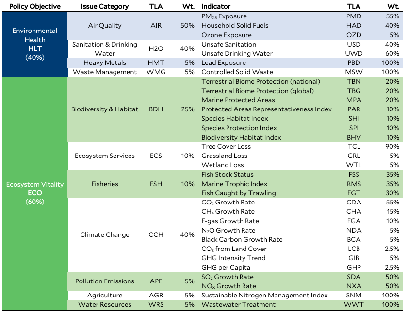

## Instructions

For this project, you will be writing your own function to perform PCA, and then exploring a dataset of environmental indicators using PCA. 

You will produce a report with two distinct parts. In Part 1 (worth 10 points), you'll implement your own function to perform PCA and will simulate data to show that your function and the built-in function in R, `princomp()`, return the same results on the simulated data. In Part 2 (worth 20 points), you will analyze data from the [Environmental Performance Index](https://epi.yale.edu/), which ranks 180 countries on 32 variables that describe environmental health and ecosystem vitality. 

For this project, please submit an .Rmd, .html, and .Rproj file. You have the option to work with a partner for this project and submit a group report. 
If you do so, you must both submit the same files on Canvas with both of your names at the top of the .html.

### Part 1 

Part 1 of your report can contain both text and code. 

Write a function `run_pca()` that will run PCA on a data matrix. Note that R has multiple functions that run PCA, including `prcomp()` and `princomp()`, these will not be accepted for part 1. Don't forget to follow the function style guide!

Your function should have the following parameters:

* `X` a matrix (or dataframe) to perform PCA on. 
* `scale` a logical value, if TRUE then run PCA on the centered and scaled version of the x dataframe (this is equivalent to doing PCA on the correlation matrix), if FALSE then run PCA on the centered but non-scaled version of the dataframe (this is equivalent to doing PCA on the covariance matrix).

Your function should return a `list` with elements:

* `prin_comps` a matrix with the same dimensions as the `X` matrix that contains the principal component vectors
* `loadings` a matrix of variable loadings, this should be a square matrix where the number of rows and columns are equal to the number of columns of `X`
* `portion_var` a vector of variances explained by each principal component

You may find the following information helpful:

* If you'd like to scale your data, for each variable find the mean and standard deviation, and then for each observation of that variable subtract the mean and divide by the standard deviation.
* Use the function `cov()` to get the empirical covariance matrix of a data matrix.
* Use the function `eigen()` to perform the eigendecomposition of a square symmetric matrix. 
* Use `%*%` to multiply matrices together. 

To understand how to put these all together to perform PCA, take a look at the class lecture slides. If you're having trouble getting started, I'd recommend writing out each step in psuedocode before translating it to code! 

To prove that your function works, run the code chunk below in your report to simulate a matrix $X$ with $4$ rows and $3$ columns full of random data. Run both `run_pca()` and `princomp()` on your simulated data. Do this once with your argument `scale = FALSE` and once with your argument `scale = TRUE` (check the help file for `princomp()`, it uses a different argument to perform scaling). Print out the principal components from each function, loadings from each function, and variances of the principal components from each function. Note that `princomp()` returns the object `sdev` which contains standard deviations of the principal components, so you will need to square this for it to match your `portion_var` vector.

```{r}
set.seed(302)
X <- matrix(nrow = 4, ncol = 3)
X[, 1] <- rnorm(4, mean = 0, sd = 1)
X[, 2] <- rnorm(4, mean = 0, sd = 10)
X[, 3] <- rnorm(4, mean = 0, sd = 15)
```

*UPDATE 02/19* When `scale = FALSE`, your function will match `princomp()` for everything except for `portion_var` and when `scale = TRUE`, your function will match `princomp()` for everything except for the vectors `prin_comps`. These differences are coming from the way that variances and standard deviations are calculated (`princomp()` uses the denominator `n` and the built-in functions you are using, `sd()` and `cov()` use the denominator `n-1`). The results that I expect you to get when running `run_pca()` are shown below. **You will get credit for having the correct answer either if your results from `run_pca()` match the results below OR the results from `princomp()`**.

```{r}
load("sim_res.Rdata")
# scale = FALSE
run_pca_scaleF
# scale = TRUE
run_pca_scaleT
```

### Part 2 

Now you'll be using your `run_pca()` function to explore the environmental performance index data. Like in Project 1, this part of your report should only have text and plots in the main body, and should be followed by a code appendix to show any code that you used for Part 2. 

You'll be using these two datasets: 

* Dataset 1: [environmental indicators for PCA](https://raw.githubusercontent.com/svteichman/STAT302-WIN2022/main/files/projects/02_dimension_reduction/pca_data.csv) 

* Dataset 2: [additional country data](https://raw.githubusercontent.com/svteichman/STAT302-WIN2022/main/files/projects/02_dimension_reduction/additional_data.csv) (see a data dictionary at the end of the instructions)

Dataset 1 has information about $29$ different environmental indicators for $180$ countries. These indicators are in the table below in the "Indicator" column and the variable names in Dataset 2 correspond with the "TLA" column.



More information can be found in this [technical appendix](https://epi.yale.edu/downloads/epi2020technicalappendix20200803.pdf). Note, the dataset I gave you does not contain the indicators FSS, RMS, or FGT for fisheries because they had too much missing data. For Part 2 you should do the following:

* Run PCA on Dataset 1 using `run_pca()` using the argument `scale = TRUE` (make sure to exclude the country name column when you pass the data into `run_pca()`).
* Plot the loadings for the first two principal components (the first two columns of `loadings` from `run_pca`) using `ggplot`. Include labels for each variable. Discuss at least one thing that you learn from this plot. 
* Plot the first two principal components of the data (the first two columns of `prin_comps` from `run_pca`) using `ggplot`. Choose a subset of five to ten countries to label. Discuss at least one thing that you learn from this plot.
* Make a scree plot for the proportion of variance explained by each principal component in your data using `ggplot`. What do you think is the ideal number of principal components to use for this dataset? Why? 
* Make at least two additional plots to explore your data, each that include at least one principal component. Look at the lecture slides for examples! If you want to use variables from Dataset 2 (which I highly suggest!!), you can join the two datasets using the function `left_join()`, since they both have the variable `country`. 
* Compare the first principal component to the variable `EPI` in the second dataset. This is the measure that the creators of this dataset made to summarise all of the environmental indicators into a single number. Did you expect your first principal component to be similar to this `EPI` measure? Why or why not? Is it? 

This content should be explained in a report for Part 2. Please include an introductory paragraph introducing the dataset and a concluding paragraph explaining what you learned from your exploration. For each plot in your report, include a short description of what the plot is (what are on the axes, what do they represent) and discuss anything that you learn about the dataset or your principal components analysis from that plot. Plot captions are optional for this project. All plots should have x and y axis labels and titles. 

All code used for Part 2 should be hidden in the body of the Part 2 report and included in a code appendix at the end. 

#### Data Dictionary for Dataset 2 
* region: region of the country, a list of countries in each region can be found on page 28 (table 2-6) of [this report](https://epi.yale.edu/downloads/epi2020report20210112.pdf)
* ldc: least developed countries, a list of countries in this group can be found on page 33 (table 2-7) of [this report](https://epi.yale.edu/downloads/epi2020report20210112.pdf)
* emmrkt: emerging markets, a list of countries in this group can be found on page 33 (table 2-7) of [this report](https://epi.yale.edu/downloads/epi2020report20210112.pdf)
* gdp: GDP for that country in 2020 
* EPI: A composite indicator of international environmental performance made up of the indicators in Dataset 1, given as a score from $0$ to $100$. More information about the weights for each indicator to compute the overall EPI score can be found on page 2 of the [technical appendix](https://epi.yale.edu/downloads/epi2020technicalappendix20200803.pdf)
