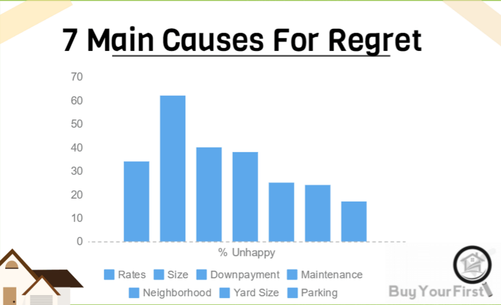
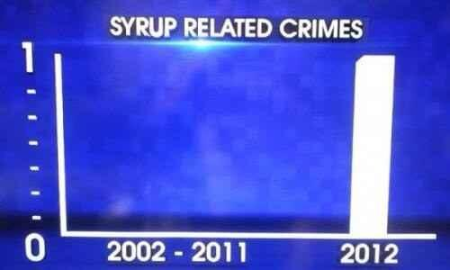
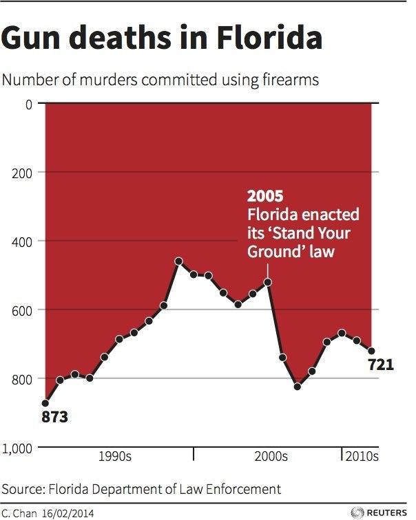
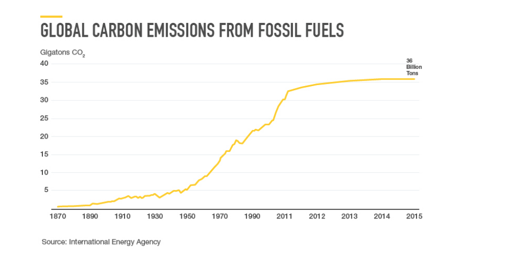

```{r setup, include=FALSE, purl=FALSE}
options(htmltools.dir.version = FALSE)
knitr::opts_chunk$set(comment = "##")
knitr::opts_chunk$set(cache = TRUE)
library(kableExtra)
```

# Today's pet picture 


```{r, echo = FALSE, out.width = "400px", fig.align = "center"}

```

---

# Outline

1. Introduction to tidyverse
2. Data Visualization
3. Data Manipulation

.middler[**Goal:** Learn how to go from raw data to exploratory data analysis. (Project 1!)]

---
class: inverse

.sectionhead[Part 1: Introduction to tidyverse]
---
layout: true

# tidyverse
---

The `tidyverse` is a collection of powerful R packages for data science. 
They include:

* Reading and saving data: `readr`
* Data manipulation: `tidyr`, `dplyr`
* Data visualization: `ggplot2`
* Working with different data structures: `tibble`, `purrr`, `stringr`, `forcats`

You can install them all using

```{r, eval = FALSE}
install.packages("tidyverse")
```

(Remember, you only need to do this once!)

---

Load them all together in your workflow documents by calling

```{r}
library(tidyverse)
```

---

## Conflicts?

Recall that packages are essentially ways for you to install and use functions 
written by others.
Occasionally, some of these functions have the same name and there is a conflict.
Whichever package you load more recently using `library` will mask the old function, meaning that R will default to that version.

In general, this is fine, especially with `tidyverse`. These package authors know when 
they have masked common functions in R, and typically we will prefer `tidyverse` version.

The conflict message is to make sure you know about conflicts. 
You can (and should) hide this in your R Markdown files by adding the parameter
`message=FALSE` or `include=FALSE` to your code chunk when you load packages.

---

## Conflicts?

If you want to use a function from a certain package you can use the syntax `package::function()`, for example `readr::read_csv`. This can be useful if:

* You want to use a function that is masked by a function in another package
* You want to reader of your code to know what package a function is from

---
layout: false
layout: true

# Pipes
---

```{r, echo = FALSE, out.width = "600px", fig.align = "center"}
knitr::include_graphics("../../files/images/pipe.jpeg")
```


---


**pipes** use the `%>%` operator to take the output from a previous function call and "pipe" it through to the next function.
This can really help with readability of code when we use multiple nested functions!

We will use the `gapminder` data from Jenny Bryan to demonstrate throughout this section.
Load the package `gapminder` (after installing) and the corresponding data.

```{r}
# install.packages("gapminder")
library(gapminder)
data(gapminder)
```

---

Let's preview the data.

```{r}
head(gapminder, 10)
```


---

## A brief note on factors

```{r}
str(gapminder)
```

**factors** are categorical data that use integer representation.

This can be efficient to store character vectors, because each string is only entered once. 
Because of this, data frames (but not tibbles!) in R default to setting strings as factors. 
However, it can also get annoying! 
Factors limit the categories, or `levels`, of the vector, which can cause problems.
---

## Functions in Functions

What if we want the mean log population within our data set? 
Using base R, we might type

```{r}
mean(log(gapminder$pop))
```

With pipes, we can use

```{r}
gapminder$pop %>%
  log() %>%
  mean()
```

---

## Functions in Functions

Both of these are acceptable. However, when we start adding more and more functions,
pipes can make your code much easier and more natural to read.

---
layout: false

# Filtering data

Very commonly, we will want to filter our data to restrict what we plot or analyze.
For example, what if we are only interested in data from China since 1970?

```{r}
head(gapminder$country == "China" & gapminder$year >= 1970)
china_1980 <- gapminder %>% 
  filter(country == "China" &
           year >= 1970)
china_1980
```

---
class: inverse

.sectionhead[Part 2: Data Visualization]
---
layout: true

# Data Visualization
---

`ggplot2` is a fantastic way to make complex publication quality<sup>1</sup> images
without much pre-processing of your data.
Plots are built sequentially using layers, so it's easy to edit and fine-tune the plots you generate.

When using `ggplot2`, it is *essential* that your data are tidy!
If they are not, the functions probably will not look like you expect.

Let's work through how to build a plot layer by layer.

.footnote[[1] or STAT302 Project quality]

---

First, let's initialize a plot. Use the `data` parameter to tell `ggplot` what data frame to use.

* It should be tidy data, in either a `data.frame` or `tibble`!

.pull-left[
```{r, eval = FALSE}
ggplot(data = gapminder) #<<
```
]

.pull-right[
```{r, echo = FALSE, fig.height = 5}
ggplot(data = gapminder) 
```
]

---

Add an aesthetic using the function `aes()` within the initial `ggplot()` call.

* Controls our axes variables as well as graphical parameters such as color, size, shape

.pull-left[
```{r, eval = FALSE}
ggplot(data = gapminder,
       aes(x = year, y = lifeExp)) #<<
```
]

.pull-right[
```{r, echo = FALSE, fig.height = 5}
ggplot(data = gapminder,
       aes(x = year, y = lifeExp)) #<<
```
]

---

Now `ggplot` knows what to plot, but it doesn't know how to plot it yet. Let's add some points with `geom_point()`.

* This is a new layer! We add layers using the `+` operator.


.pull-left[
```{r, eval = FALSE}
ggplot(data = gapminder,
       aes(x = year, y = lifeExp)) +
  geom_point() #<<
```
]

.pull-right[
```{r, echo = FALSE, fig.height = 5}
ggplot(data = gapminder,
       aes(x = year, y = lifeExp)) +
  geom_point() #<<
```
]

---

Let's make our points smaller and red.

.pull-left[
```{r, eval = FALSE}
ggplot(data = gapminder,
       aes(x = year, y = lifeExp)) +
  geom_point(color = "red", size = 0.75) #<<
```
]

.pull-right[
```{r, echo = FALSE, fig.height = 5}
ggplot(data = gapminder,
       aes(x = year, y = lifeExp)) +
  geom_point(color = "red", size = 0.75) #<<
```
]

---

Let's try switching them to lines.

.pull-left[
```{r, eval = FALSE}
ggplot(data = gapminder,
       aes(x = year, y = lifeExp)) +
  geom_line(color = "red", size = 0.75) #<<
```
]

.pull-right[
```{r, echo = FALSE, fig.height = 5}
ggplot(data = gapminder,
       aes(x = year, y = lifeExp)) +
  geom_line(color = "red", size = 0.75) #<<
```
]

---

We want lines connected by country, not just in the order they appear in the data.

.pull-left[
```{r, eval = FALSE}
ggplot(data = gapminder,
       aes(x = year, y = lifeExp,
           group = country)) + #<<
  geom_line(color = "red", size = 0.5) 
```
]

.pull-right[
```{r, echo = FALSE, fig.height = 5}
ggplot(data = gapminder,
       aes(x = year, y = lifeExp,
           group = country)) + #<<
  geom_line(color = "red", size = 0.5) 
```
]

---

We want to explore differences across continents, so let's color by continent

* We use `aes()` because we want to color by something in our data
* Putting a color within `aes()` will automatically add a label
* We have to remove the color within `geom_line()`, or it will override the `aes()`


.pull-left[
```{r, eval = FALSE}
ggplot(data = gapminder,
       aes(x = year, y = lifeExp,
           group = country,
           color = continent)) + #<<
  geom_line(size = 0.5)  #<<
```
]

.pull-right[
```{r, echo = FALSE, fig.height = 5}
ggplot(data = gapminder,
       aes(x = year, y = lifeExp,
           group = country,
           color = continent)) + #<<
  geom_line(size = 0.5) #<<
```
]

---

Let's add another layer. Trendlines by continent!

* We want them grouped differently than our lines (by continent), so we use a new `aes()`
* We will make them stick out by having them be thicker and black
* We don't want error bars, so we will remove `se`
* We will use the default option `loess`. (See `?geom_smooth()`)

.pull-left[
```{r, eval = FALSE, message = FALSE}
ggplot(data = gapminder,
       aes(x = year, y = lifeExp,
           group = country,
           color = continent)) + 
  geom_line(size = 0.5) +
  geom_smooth(aes(group = continent), #<<
              se = FALSE, size = 1.5, #<<
              color = "black", #<<
              method = "loess") #<<
```
]

.pull-right[
```{r, echo = FALSE, fig.height = 5, message = FALSE}
ggplot(data = gapminder,
       aes(x = year, y = lifeExp,
           group = country,
           color = continent)) + 
  geom_line(size = 0.5) +
  geom_smooth(aes(group = continent), #<<
              se = FALSE, size = 1.5, #<<
              color = "black", #<<
              method = "loess") #<<
```
]

---


This is cluttered and hard to read. Let's try separating by continents using **facets**!

* We use `facet_wrap` 
* Takes in a **formula** object. Use a tilde `~` and then the variable name you want

.pull-left[
```{r, eval = FALSE, message = FALSE}
ggplot(data = gapminder,
       aes(x = year, y = lifeExp,
           group = country,
           color = continent)) + 
  geom_line(size = 0.5) +
  geom_smooth(aes(group = continent), 
              se = FALSE, size = 1.5, 
              color = "black", 
              method = "loess") +
  facet_wrap(~ continent) #<<
```
]

.pull-right[
```{r, echo = FALSE, fig.height = 5, message = FALSE}
ggplot(data = gapminder,
       aes(x = year, y = lifeExp,
           group = country,
           color = continent)) + 
  geom_line(size = 0.5) +
  geom_smooth(aes(group = continent), 
              se = FALSE, size = 1.5, 
              color = "black", 
              method = "loess") +
  facet_wrap(~ continent) #<<
```
]

---

Looking better! Now let's fine tune. First we'll formalize the labels on our plot using `labs()`.

* Can also edit labels one at a time using `xlab()`, `ylab()`, `ggmain()`, ...
* You should probably do this in every graph you present! Very rarely do you want the text styling of your data frame to match your output. Emphasis here on human readability!

---

```{r, eval = FALSE, message = FALSE}
ggplot(data = gapminder,
       aes(x = year, y = lifeExp,
           group = country,
           color = continent)) + 
  geom_line(size = 0.5) +
  geom_smooth(aes(group = continent), 
              se = FALSE, size = 1.5, 
              color = "black", 
              method = "loess") +
  facet_wrap(~ continent) +
  labs(title = "Life expectancy over time by continent", #<<
       x = "Year", y = "Life Expectancy", #<<
       legend = "Continent") #<<
```

---

.middler[
```{r, echo = FALSE, fig.height = 5, message = FALSE}
ggplot(data = gapminder,
       aes(x = year, y = lifeExp,
           group = country,
           color = continent)) + 
  geom_line(size = 0.5) +
  geom_smooth(aes(group = continent), 
              se = FALSE, size = 1.5, 
              color = "black", 
              method = "loess") +
  facet_wrap(~ continent) +
  labs(title = "Life expectancy over time by continent", #<<
       x = "Year", y = "Life Expectancy", #<<
       legend = "Continent") #<<
```
]

---

Let's center our title by adjusting `theme()`.

* `element_text()` tells ggplot how to display the text. Used for fine-tuning
* `hjust` is our horizontal alignment, we set it to one half


```{r, eval = FALSE, message = FALSE}
ggplot(data = gapminder,
       aes(x = year, y = lifeExp,
           group = country,
           color = continent)) + 
  geom_line(size = 0.5) +
  geom_smooth(aes(group = continent), 
              se = FALSE, size = 1.5, color = "black", method = "loess") +
  facet_wrap(~ continent) +
  labs(title = "Life expectancy over time by continent", 
       x = "Year", y = "Life Expectancy", legend = "Continent") +
  theme(plot.title = element_text(hjust = 0.5, #<<
                                  face = "bold", #<<
                                  size = 14)) #<<
```

---

.middler[
```{r, echo = FALSE, fig.height = 5, message = FALSE}
ggplot(data = gapminder,
       aes(x = year, y = lifeExp,
           group = country,
           color = continent)) + 
  geom_line(size = 0.5) +
  geom_smooth(aes(group = continent), 
              se = FALSE, size = 1.5, color = "black", method = "loess") +
  facet_wrap(~ continent) +
  labs(title = "Life expectancy over time by continent", 
       x = "Year", y = "Life Expectancy", legend = "Continent") +
  theme(plot.title = element_text(hjust = 0.5, #<<
                                  face = "bold", #<<
                                  size = 14)) #<<
```
]

---

Actually, that legend is redundant. Let's remove it.

```{r, eval = FALSE, message = FALSE}
ggplot(data = gapminder,
       aes(x = year, y = lifeExp,
           group = country,
           color = continent)) + 
  geom_line(size = 0.5) +
  geom_smooth(aes(group = continent), 
              se = FALSE, size = 1.5, color = "black", method = "loess") +
  facet_wrap(~ continent) +
  labs(title = "Life expectancy over time by continent", 
       x = "Year", y = "Life Expectancy") +
  theme(plot.title = element_text(hjust = 0.5, face = "bold", size = 14),
        legend.position = "none") #<<
```

---

.middler[
```{r, echo = FALSE, fig.height = 5, message = FALSE}
ggplot(data = gapminder,
       aes(x = year, y = lifeExp,
           group = country,
           color = continent)) + 
  geom_line(size = 0.5) +
  geom_smooth(aes(group = continent), 
              se = FALSE, size = 1.5, color = "black", method = "loess") +
  facet_wrap(~ continent) +
  labs(title = "Life expectancy over time by continent", 
       x = "Year", y = "Life Expectancy") +
  theme(plot.title = element_text(hjust = 0.5, face = "bold", size = 14),
        legend.position = "none") #<<
```
]

---

I don't like the default gray background. I almost always set the `theme_bw()`.

* There are several other theme options! Too many to list, so look them up if you want more options.

```{r, eval = FALSE, message = FALSE}
ggplot(data = gapminder,
       aes(x = year, y = lifeExp,
           group = country,
           color = continent)) + 
  geom_line(size = 0.5) +
  geom_smooth(aes(group = continent), 
              se = FALSE, size = 1.5, color = "black", method = "loess") +
  facet_wrap(~ continent) +
  labs(title = "Life expectancy over time by continent", 
       x = "Year", y = "Life Expectancy") +
  theme(plot.title = element_text(hjust = 0.5, face = "bold", size = 14),
        legend.position = "none") +
  theme_bw() #<<
```

---

.middler[
```{r, echo = FALSE, fig.height = 5, message = FALSE}
ggplot(data = gapminder,
       aes(x = year, y = lifeExp,
           group = country,
           color = continent)) + 
  geom_line(size = 0.5) +
  geom_smooth(aes(group = continent), 
              se = FALSE, size = 1.5, color = "black", method = "loess") +
  facet_wrap(~ continent) +
  labs(title = "Life expectancy over time by continent", 
       x = "Year", y = "Life Expectancy") +
  theme(plot.title = element_text(hjust = 0.5, face = "bold", size = 14),
        legend.position = "none") +
  theme_bw() #<<
```
]

---

This overwrote our custome `theme()` settings! Let's reorder the layers.

```{r, eval = FALSE, message = FALSE}
ggplot(data = gapminder,
       aes(x = year, y = lifeExp,
           group = country,
           color = continent)) + 
  geom_line(size = 0.5) +
  geom_smooth(aes(group = continent), 
              se = FALSE, size = 1.5, color = "black", method = "loess") +
  facet_wrap(~ continent) +
  labs(title = "Life expectancy over time by continent", 
       x = "Year", y = "Life Expectancy") +
  theme_bw() + #<<
  theme(plot.title = element_text(hjust = 0.5, face = "bold", size = 14), #<<
        legend.position = "none") #<<
```

---

.middler[
```{r, echo = FALSE, fig.height = 5, message = FALSE}
ggplot(data = gapminder,
       aes(x = year, y = lifeExp,
           group = country,
           color = continent)) + 
  geom_line(size = 0.5) +
  geom_smooth(aes(group = continent), 
              se = FALSE, size = 1.5, color = "black", method = "loess") +
  facet_wrap(~ continent) +
  labs(title = "Life expectancy over time by continent", 
       x = "Year", y = "Life Expectancy") +
  theme_bw() + #<<
  theme(plot.title = element_text(hjust = 0.5, face = "bold", size = 14), #<<
        legend.position = "none") #<<
```
]

---

We can make this more readable. Be careful of text that is too small! 
Let's increase all of our text proportionally using `base_size` within `theme_bw()`.

* We could also do this by adjusting `text` within `theme()`
* Note that we no longer need to manually adjust our title size. This will scale everything automatically.

```{r, eval = FALSE, message = FALSE}
ggplot(data = gapminder,
       aes(x = year, y = lifeExp,
           group = country,
           color = continent)) + 
  geom_line(size = 0.5) +
  geom_smooth(aes(group = continent), 
              se = FALSE, size = 1.5, color = "black", method = "loess") +
  facet_wrap(~ continent) +
  labs(title = "Life expectancy over time by continent", 
       x = "Year", y = "Life Expectancy") +
  theme_bw(base_size = 16) + #<<
  theme(plot.title = element_text(hjust = 0.5, face = "bold"), #<<
        legend.position = "none") 
```

---

.middler[
```{r, echo = FALSE, fig.height = 5, message = FALSE}
ggplot(data = gapminder,
       aes(x = year, y = lifeExp,
           group = country,
           color = continent)) + 
  geom_line(size = 0.5) +
  geom_smooth(aes(group = continent), 
              se = FALSE, size = 1.5, color = "black", method = "loess") +
  facet_wrap(~ continent) +
  labs(title = "Life expectancy over time by continent", 
       x = "Year", y = "Life Expectancy") +
  theme_bw(base_size = 16) + #<<
  theme(plot.title = element_text(hjust = 0.5, face = "bold"), #<<
        legend.position = "none") 
```
]


---

Almost there! Now our text is a good size, but it overlaps. There are a few ways we could fix this. We'll rotate our text.


```{r, eval = FALSE, message = FALSE}
ggplot(data = gapminder,
       aes(x = year, y = lifeExp,
           group = country,
           color = continent)) + 
  geom_line(size = 0.5) +
  geom_smooth(aes(group = continent), 
              se = FALSE, size = 1.5, color = "black", method = "loess") +
  facet_wrap(~ continent) +
  labs(title = "Life expectancy over time by continent", 
       x = "Year", y = "Life Expectancy") +
  theme_bw(base_size = 16) + 
  theme(plot.title = element_text(hjust = 0.5, face = "bold"), 
        legend.position = "none",
        axis.text.x = element_text(angle = 45, hjust = 1, vjust = 1)) #<< 
```

---

.middler[
```{r, echo = FALSE, fig.height = 5, message = FALSE}
ggplot(data = gapminder,
       aes(x = year, y = lifeExp,
           group = country,
           color = continent)) + 
  geom_line(size = 0.5) +
  geom_smooth(aes(group = continent), 
              se = FALSE, size = 1.5, color = "black", method = "loess") +
  facet_wrap(~ continent) +
  labs(title = "Life expectancy over time by continent", 
       x = "Year", y = "Life Expectancy") +
  theme_bw(base_size = 16) + 
  theme(plot.title = element_text(hjust = 0.5, face = "bold"), 
        legend.position = "none",
        axis.text.x = element_text(angle = 45, hjust = 1, vjust = 1)) #<< 
```
]

---

Lastly, let's space out our panels by adjusting `panel.spacing.x`.

```{r, eval = FALSE, message = FALSE}
ggplot(data = gapminder,
       aes(x = year, y = lifeExp,
           group = country,
           color = continent)) + 
  geom_line(size = 0.5) +
  geom_smooth(aes(group = continent), 
              se = FALSE, size = 1.5, color = "black", method = "loess") +
  facet_wrap(~ continent) +
  labs(title = "Life expectancy over time by continent", 
       x = "Year", y = "Life Expectancy") +
  theme_bw(base_size = 16) + 
  theme(plot.title = element_text(hjust = 0.5, face = "bold"), 
        legend.position = "none",
        axis.text.x = element_text(angle = 45, hjust = 1, vjust = 1),
        panel.spacing.x = unit(0.75, "cm")) #<<
```

---

.middler[
```{r, echo = FALSE, fig.height = 5, message = FALSE}
ggplot(data = gapminder,
       aes(x = year, y = lifeExp,
           group = country,
           color = continent)) + 
  geom_line(size = 0.5) +
  geom_smooth(aes(group = continent), 
              se = FALSE, size = 1.5, color = "black", method = "loess") +
  facet_wrap(~ continent) +
  labs(title = "Life expectancy over time by continent", 
       x = "Year", y = "Life Expectancy") +
  theme_bw(base_size = 16) + 
  theme(plot.title = element_text(hjust = 0.5, face = "bold"), 
        legend.position = "none",
        axis.text.x = element_text(angle = 45, hjust = 1, vjust = 1),
        panel.spacing.x = unit(0.75, "cm")) #<<
```
]

---

Great, that looks good! Now we can store it as an object.

```{r}
lifeExp_plot <- ggplot(data = gapminder, #<<
                       aes(x = year, y = lifeExp,
                           group = country,
                           color = continent)) + 
  geom_line(size = 0.5) +
  geom_smooth(aes(group = continent), 
              se = FALSE, size = 1.5, color = "black", method = "loess") +
  facet_wrap(~ continent) +
  labs(title = "Life expectancy over time by continent", 
       x = "Year", y = "Life Expectancy") +
  theme_bw(base_size = 16) + 
  theme(plot.title = element_text(hjust = 0.5, face = "bold"), 
        legend.position = "none",
        axis.text.x = element_text(angle = 45, hjust = 1, vjust = 1),
        panel.spacing.x = unit(0.75, "cm")) 
```

---

Then we can plot it by just calling our object.

```{r, fig.height = 5, eval = FALSE, message = FALSE}
lifeExp_plot
```

.center[
```{r, fig.height = 5, echo = FALSE, message = FALSE}
lifeExp_plot
```
]

---


We can also save it in our `Figures` subfolder using `ggsave()`.

* Set `height` and `width` parameters to automatically resize the image


```{r, eval = FALSE}
ggsave(filename = "Figures/lifeExp_plot.pdf", plot = lifeExp_plot,
       height = 5, width = 7)
```

.center[**Never** save a figure from your analysis using screenshots or point-and-click!

They will be lower quality and non-reproducible!]

---

## Some comments on `ggplot`:

* What we just made was a *very* complicated and fine-tuned plot!
* I have to Google how to adjust certain things all the time
* So does the creator of `ggplot2`

.center[]

---

## A simpler example: Histogram

.pull-left[
```{r, eval = FALSE}
ggplot(data = gapminder, #<<
       aes(x = lifeExp)) #<<
```
]

.pull-right[
```{r, echo = FALSE, fig.height = 5}
ggplot(data = gapminder, #<<
       aes(x = lifeExp)) #<<
```
]

---

## A simpler example: Histogram

.pull-left[
```{r, eval = FALSE}
ggplot(data = gapminder,
       aes(x = lifeExp)) + 
  geom_histogram() #<<
```
]

.pull-right[
```{r, echo = FALSE, fig.height = 5}
ggplot(data = gapminder,
       aes(x = lifeExp)) + 
  geom_histogram() #<<
```
]

---

## A simpler example: Histogram

.pull-left[
```{r, eval = FALSE}
ggplot(data = gapminder,
       aes(x = lifeExp)) + 
  geom_histogram(binwidth = 1) #<<
```
]

.pull-right[
```{r, echo = FALSE, fig.height = 5}
ggplot(data = gapminder,
       aes(x = lifeExp)) + 
  geom_histogram(binwidth = 1) #<<
```
]

---

## A simpler example: Histogram

.pull-left[
```{r, eval = FALSE}
ggplot(data = gapminder,
       aes(x = lifeExp)) + 
  geom_histogram(binwidth = 1, 
                 color = "black", #<<
                 fill = "lightblue") #<<
```
]

.pull-right[
```{r, echo = FALSE, fig.height = 5}
ggplot(data = gapminder,
       aes(x = lifeExp)) + 
  geom_histogram(binwidth = 1, 
                 color = "black", #<<
                 fill = "lightblue") #<<
```
]

---

## A simpler example: Histogram

.pull-left[
```{r, eval = FALSE}
ggplot(data = gapminder,
       aes(x = lifeExp)) + 
  geom_histogram(binwidth = 1, 
                 color = "black", 
                 fill = "lightblue") +
  theme_bw(base_size = 20) #<<
```
]

.pull-right[
```{r, echo = FALSE, fig.height = 5}
ggplot(data = gapminder,
       aes(x = lifeExp)) + 
  geom_histogram(binwidth = 1, 
                 color = "black", 
                 fill = "lightblue") +
  theme_bw(base_size = 20) #<<
```
]

---

## A simpler example: Histogram

.pull-left[
```{r, eval = FALSE}
ggplot(data = gapminder,
       aes(x = lifeExp)) + 
  geom_histogram(binwidth = 1, 
                 color = "black", 
                 fill = "lightblue") +
  theme_bw(base_size = 20) +
  labs(x = "Life Expectancy", #<<
       y = "Count") #<<
```
]

.pull-right[
```{r, echo = FALSE, fig.height = 5}
ggplot(data = gapminder,
       aes(x = lifeExp)) + 
  geom_histogram(binwidth = 1, 
                 color = "black", 
                 fill = "lightblue") +
  theme_bw(base_size = 20) +
  labs(x = "Life Expectancy", #<<
       y = "Count") #<<
```
]

---

## A simpler example: Boxplots

.pull-left[
```{r, eval = FALSE}
ggplot(data = gapminder, #<<
       aes(x = continent, y = lifeExp)) #<<
```
]

.pull-right[
```{r, echo = FALSE, fig.height = 5}
ggplot(data = gapminder, #<<
       aes(x = continent, y = lifeExp)) #<<
```
]

---

## A simpler example: Boxplots

.pull-left[
```{r, eval = FALSE}
ggplot(data = gapminder, 
       aes(x = continent, y = lifeExp)) +
  geom_boxplot() #<<
```
]

.pull-right[
```{r, echo = FALSE, fig.height = 5}
ggplot(data = gapminder, 
       aes(x = continent, y = lifeExp)) +
  geom_boxplot() #<<
```
]

---

## A simpler example: Boxplots

.pull-left[
```{r, eval = FALSE}
ggplot(data = gapminder, 
       aes(x = continent, y = lifeExp)) +
  geom_boxplot(fill = "lightblue") #<<
```
]

.pull-right[
```{r, echo = FALSE, fig.height = 5}
ggplot(data = gapminder, 
       aes(x = continent, y = lifeExp)) +
  geom_boxplot(fill = "lightblue") #<<
```
]

---

## A simpler example: Boxplots

.pull-left[
```{r, eval = FALSE}
ggplot(data = gapminder, 
       aes(x = continent, y = lifeExp)) +
  geom_boxplot(fill = "lightblue") +
  theme_bw(base_size = 20) #<<
```
]

.pull-right[
```{r, echo = FALSE, fig.height = 5}
ggplot(data = gapminder, 
       aes(x = continent, y = lifeExp)) +
  geom_boxplot(fill = "lightblue") +
  theme_bw(base_size = 20) #<<
```
]

---

## A simpler example: Boxplots

.pull-left[
```{r, eval = FALSE}
ggplot(data = gapminder, 
       aes(x = continent, y = lifeExp)) +
  geom_boxplot(fill = "lightblue") +
  theme_bw(base_size = 20) +
  labs(title = "Life expectancy by Continent", #<<
       x = "", #<<
       y = "") #<<
```
]

.pull-right[
```{r, echo = FALSE, fig.height = 5}
ggplot(data = gapminder, 
       aes(x = continent, y = lifeExp)) +
  geom_boxplot(fill = "lightblue") +
  theme_bw(base_size = 20) +
  labs(title = "Life expectancy by Continent", #<<
       x = "", #<<
       y = "") #<<
```
]

---

## A simpler example: Boxplots

.pull-left[
```{r, eval = FALSE}
ggplot(data = gapminder, 
       aes(x = continent, y = lifeExp)) +
  geom_boxplot(fill = "lightblue") +
  theme_bw(base_size = 20) +
  labs(title = "Life expectancy by Continent", 
       x = "", 
       y = "") +
  theme(plot.title = #<<
          element_text(hjust = 0.5)) #<<
```
]

.pull-right[
```{r, echo = FALSE, fig.height = 5}
ggplot(data = gapminder, 
       aes(x = continent, y = lifeExp)) +
  geom_boxplot(fill = "lightblue") +
  theme_bw(base_size = 20) +
  labs(title = "Life expectancy by Continent", 
       x = "", 
       y = "") +
  theme(plot.title = #<<
          element_text(hjust = 0.5)) #<<
```
]

---

## A simpler example: Boxplots

.pull-left[
```{r, eval = FALSE}
ggplot(data = gapminder, 
       aes(x = continent, y = lifeExp)) +
  geom_boxplot(fill = "lightblue") +
  theme_bw(base_size = 20) +
  labs(title = "Life expectancy by Continent", 
       x = "", 
       y = "") +
  theme(plot.title =
          element_text(hjust = 0.5)) +
  ylim(c(0, 85)) #<<
```
]

.pull-right[
```{r, echo = FALSE, fig.height = 5}
ggplot(data = gapminder, 
       aes(x = continent, y = lifeExp)) +
  geom_boxplot(fill = "lightblue") +
  theme_bw(base_size = 20) +
  labs(title = "Life expectancy by Continent", 
       x = "", 
       y = "") +
  theme(plot.title =
          element_text(hjust = 0.5)) +
  ylim(c(0, 85)) #<<
```
]

---

.pull-left[## Don'ts
* 3D plots
* Deceptive axes
* Excessive labels
* Excessive/bad coloring
* Fancy shading/effects
* Bad variable/axis names
* Unreadable labels
* Overloaded with information
]

.pull-right[## Do's
* Simple, clean graphics
* Neat and human readable text
* Appropriate data range (bar charts should *always* start from 0!)
* Consistent intervals
* Roughly ~6 colors or less
* Size figures appropriately
]

---
layout: false
layout: true

# Bad Visualizations!

---

.center[]

--

**No-no:** Pie charts! These proportions are completely off!
---

.center[]

--

**No-no:** Pie charts! These percents don't add up!

---

.center[]

--

**No-no:** 3d bar charts?!

---

.center[]

--

**No-no:** Bad use of color

---

.center[]

--

**No-no:** Bad axis, lack of information, 3D bar chart

---

.center[]

--

**No-no:** Four numbers displayed as a cluttered chart, terrible labels, bad axis range

---

.center[]

--

**No-no:** Deceptively flipped y-axis! (and excessive color)

---

.center[]
.center[(This was presented in Congress!)]

--

**No-no:** Two axes in a single plot, bad axis range

---

.center[]

--

**No-no:** Deceptive axis range (should start at 0)

---

.center[]
.center[(From the Gates Foundation!)]

--

**No-no:** Inconsistent x-axis intervals

---
layout: false

# ggplot cheatsheet

* Axes: `xlim()`, `ylim()`
* Legends: within initial `aes()`, edit within `theme()` or `guides()`
* `geom_point()`, `geom_line()`, `geom_histogram()`, `geom_bar()`, `geom_boxplot()`, `geom_text()`
* `facet_grid()`, `facet_wrap()` for faceting
* `labs()` for labels
* `theme_bw()` to make things look nicer
* Graphical parameters: `color` for color, `alpha` for opacity, `lwd`/`size` for thickness, `shape` for shape, `fill` for interior color, ...

.pushdown[.center[[Much, much more! (Click me for a cheat sheet!)](https://rstudio.com/resources/cheatsheets/)]]

---

# Today's pet picture 


```{r, echo = FALSE, out.width = "500px", fig.align = "center"}
knitr::include_graphics("../../files/images/pets/duke.png")
```

---

# Before we start 

Let's reload the gapminder package.

```{r}
library(gapminder)
data(gapminder)
```

Remind ourselves what data is here.

```{r}
head(gapminder)
```

---

# Before we start 

Let's make a bar chart for the number of observations for each continent.

.pull-left[
```{r, eval = FALSE}
ggplot(data = gapminder, 
       aes(x = continent)) 
```
]

.pull-right[
```{r, echo = FALSE, fig.height = 5}
ggplot(data = gapminder, 
       aes(x = continent))
```
]

---

# Before we start 

Let's make a bar chart for the number of observations for each continent.

.pull-left[
```{r, eval = FALSE}
ggplot(data = gapminder, 
       aes(x = continent)) + 
  geom_bar()
```
]

.pull-right[
```{r, echo = FALSE, fig.height = 5}
ggplot(data = gapminder, 
       aes(x = continent)) + 
  geom_bar()
```
]

---

# Before we start 

Let's make a bar chart for the number of observations for each continent.

.pull-left[
```{r, eval = FALSE}
ggplot(data = gapminder, 
       aes(x = continent)) + 
  geom_bar() +
  theme_bw(base_size = 20) +
  labs(title = "Observations by Continent", 
       x = "Continent", 
       y = "Number of Observations") +
  theme(plot.title =
          element_text(hjust = 0.5)) 
```
]

.pull-right[
```{r, echo = FALSE, fig.height = 5}
ggplot(data = gapminder, 
       aes(x = continent)) + 
  geom_bar() +
  theme_bw(base_size = 20) +
  labs(title = "Observations by Continent", 
       x = "Continent", 
       y = "Number of Observations") +
  theme(plot.title =
          element_text(hjust = 0.5)) 
```
]

---

# Before we start 

However, what if we want to plot the differences between the minimum and maximum life expectancy for each country in Europe? 

```{r}
head(gapminder)
```

---

# Before we start 

However, what if we want to plot the differences between the minimum and maximum life expectancy for each country in Europe? 

We know how to filter the data to only include data in Europe. 

```{r}
gapminder %>% 
  filter(continent == "Europe") %>%
  head()
```

But what about the rest?

---

class: inverse

.sectionhead[Part 3: Data Manipulation]

---
layout: true

# <TT>select()</TT>: Column selection

---

Use `select()` to choose certain columns.

```{r}
gapminder %>% 
  select(lifeExp, gdpPercap)
```

---
Use `select()` to choose certain columns.
We can also use `select()` to remove certain columns by putting a `-` symbol in front.

```{r}
gapminder %>% 
  select(-lifeExp, -gdpPercap)
```

---

`select()` has a number of helper functions to select columns (see `?select`).
Notably:
* `starts_with()` for prefixes
* `ends_with()` for suffixes
* `contains()` for strings

```{r}
names(gapminder)
gapminder %>%
  select(starts_with("co")) %>%
  head()
```

---

`select()` has a number of helper functions to select columns (see `?select`).
Notably:
* `starts_with()` for prefixes
* `ends_with()` for suffixes
* `contains()` for strings

```{r}
names(gapminder)
gapminder %>%
  select(ends_with("p")) %>%
  head()
```

---

`select()` has a number of helper functions to select columns (see `?select`).
Notably:
* `starts_with()` for prefixes
* `ends_with()` for suffixes
* `contains()` for strings

```{r}
names(gapminder)
gapminder %>%
  select(contains("Per")) %>%
  head()
```
---

`select()` has a number of helper functions to select columns (see `?select`).
Notably:
* `starts_with()` for prefixes
* `ends_with()` for suffixes
* `contains()` for strings

This can be particularly helpful when you have data in "wide" format! (such as `category_01`, `category_02`, `category_03`, ...)


---
layout: false
layout: true

# <TT>mutate()</TT>: create new columns


Create and transform variables from existing variables using `mutate()`. 

`mutate(NEW_VAR_NAME = ...)`.

---

```{r}
gapminder %>%
  mutate(gdp = gdpPercap * pop) %>%
  head()
```

---

Note that we can use existing columns, including those we created within the same call to `mutate()`.

```{r}
gapminder %>%
  mutate(gdp = gdpPercap * pop,
         logGDP = log(gdp)) %>% 
  head()
```

---
layout: false
layout: true
# <TT>ifelse()</TT>: conditional selection

---

`ifelse()` takes in a logical test and conditional responses, and returns a vector of values based on the output of the test. It can be very useful for data cleaning (among other uses)!

`ifelse(test, yes, no)`

* `test`: the logical test
* `yes`: return values for when `test` is `TRUE`
* `no`: return values for when `test` is `FALSE`

```{r}
demo <- -2:2
demo > 0
ifelse(demo > 0, "strictly positive", "not strictly positive")
```

---

`ifelse()` can be very useful within `mutate()`.
For example, if we want to use the country code `USA` instead of `United States`, and store this variable `country_clean` as a character type instead of a factor, we can use:

```{r}
gapminder %>%
  mutate(country_clean =
           ifelse(country == "United States",
                  "USA", as.character(country))) %>%
  filter(year == 2007,
         continent == "Americas") %>%
  select(country, country_clean) %>%
  tail()
```

---
layout: false
layout: true
# <TT>%in%</TT>: value matching

`%in%` is a binary operator, which returns a boolean vector indicating whether
components in the left-hand side are found in the right-hand side.

---

```{r}
1 %in% 1:5
1 %in% -1:-5
c(0, 1, 2, 7) %in% 1:5
```

---

To negate the `%in%` operator, wrap the entire logical statement within `!(...)`.

```{r}
!(1 %in% 1:5)
!(1 %in% -1:-5)
!(c(0, 1, 2, 7) %in% 1:5)
```


---

```{r}
gapminder %>%
  filter(continent %in% c("Americas", "Europe")) %>%
  filter(year %in% c(2002, 2007)) %>%
  head()
```

---
layout: false
layout: true
# split-apply-combine

---
*split-apply-combine* is a data analysis strategy where you *split* the data up into pieces, *apply* some operation on each piece, and then *combine* all the pieces back together. 
It's useful for breaking big problems into smaller manageable chunks!

---

## `group_by()`

You can use `group_by()` to define a grouping of the rows of your data based on the columns.
Notice that it doesn't change our data, except for that we can now see that it has 5 groups.

```{r}
grouped_gap <- gapminder %>%
  group_by(continent)
class(grouped_gap)
head(grouped_gap, 4)
```

---

## `group_by()`

You can use `group_by()` to define a grouping of the rows of your data based on the columns.
We can remove the groups with `ungroup()`.

```{r}
ungrouped_gap <- ungroup(grouped_gap)
class(ungrouped_gap)
head(ungrouped_gap)
```

---

## `summarize()`

`summarize()` (or `summarise()`, if you prefer) will apply functions to rows of a data frame. If a data frame is grouped, the function will be applied by group.

```{r, message = FALSE}
gapminder %>%
  group_by(continent) %>%
  summarize(mean_lifeExp = mean(lifeExp, na.rm = TRUE),
            max_gdp = max(gdpPercap))
```

Notice that this creates an entirely new (and much smaller) data frame. Typically we want to store this object as a variable, but not as the same variable as our data!

---

## `arrange()`

We can order the rows of the data using `arrange()`. Usually, you do this after some call to `summarize()`. 

```{r, message = FALSE}
gapminder %>%
  group_by(continent) %>%
  summarize(mean_lifeExp = mean(lifeExp, na.rm = TRUE),
            max_gdp = max(gdpPercap)) %>%
  arrange(mean_lifeExp)
```

---

## `arrange()`

We can order the rows of the data using `arrange()`. Usually, you do this after some call to `summarize()`. We can use `desc()` to put in decreasing order.

```{r, message = FALSE}
gapminder %>%
  group_by(continent) %>%
  summarize(mean_lifeExp = mean(lifeExp, na.rm = TRUE),
            max_gdp = max(gdpPercap)) %>%
  arrange(desc(mean_lifeExp))
```


---

## `count()`

If we want to count by groups, we can use the notation we've already earned.

```{r, message = FALSE}
gapminder %>%
  group_by(continent) %>%
  summarize(count = n())
```

---

## `count()`

Alternatively, we can use the shorthand `count()`, with optional argument `sort` to order.

```{r}
gapminder %>%
  count(continent, sort = FALSE)
```

---

## `count()`

We can also count combinations of categories by supplying multiple variables to `count()`.

```{r}
gapminder %>%
  count(continent, country)
```

---

## `count()`

We can also count combinations of categories by supplying multiple variables to `count()`, we can then sort using `arrange()`.

```{r}
gapminder %>%
  count(continent, country) %>%
  arrange(country, desc(n))
```


---
layout:false 

# <TT>pull()</TT>: extract column as vector

You can use `pull()` to extract a single column as a vector. Notice the difference between

```{r}
gapminder %>%
  select(lifeExp) %>%
  head(4)
```

```{r}
gapminder %>%
  pull(lifeExp) %>%
  head(10)
```


---
# <TT>rename()</TT>: ...renaming!

`rename(data, NEW_VAR_NAME = OLD_VAR_NAME)`

```{r}
gapminder %>%
  rename(life_exp = lifeExp)
```


---
layout: true

# Re-arranging Data

---

## `pivot_longer()`

Let's load the `relig_income` data from tidyverse.

```{r}
data(relig_income)
head(relig_income)
```

---

## `pivot_longer()`

We can use `pivot_longer()` to go from data in "wide" form to data in "long" form.

```{r}
relig_income %>%
  pivot_longer(cols = contains("$"), 
               names_to = "income",  
               values_to = "count")
```

---

## `pivot_longer()`

Looks like we missed a few of the income column names. 

```{r}
relig_income %>%
  pivot_longer(cols = c(contains("$"), ">150k", "Don't know/refused"), 
               names_to = "income",
               values_to = "count") 
```

---
## `pivot_longer()`

Let's load the `billboard` data from tidyverse.

```{r}
data(billboard)
head(billboard)
```

---
## `pivot_longer()`

```{r}
billboard %>%
 pivot_longer(
   cols = starts_with("wk"),
   names_to = "week",
   names_prefix = "wk",
   values_to = "rank",
   values_drop_na = TRUE
 ) %>% 
  head(8)
```

---
## `pivot_wider()`

Let's load the `fish_encounters` data from tidyverse.

```{r}
data(fish_encounters)
head(fish_encounters, 12)
```

---

## `pivot_wider()`

We can use `pivot_wider()` to go from data in "long" form to data in "wide" form.

```{r}
fish_encounters %>%
  pivot_wider(names_from = station, values_from = seen) %>%
  head(12)
```


---

## `pivot_wider()`

```{r}
fish_encounters %>%
  pivot_wider(
    names_from = station,
    values_from = seen,
    values_fill = list(seen = 0)
  ) %>%
  head(9)
```


---
## `pivot_wider()`

Let's load the `us_rent_income` data from tidyverse.

```{r}
data(us_rent_income)
head(us_rent_income)
```

---

## `pivot_wider()`

```{r}
us_rent_income %>%
  pivot_wider(names_from = variable, values_from = c(estimate, moe))
```

---
layout: false
layout: true

# Joining Data

---

We can use SQL-like join statements in R!


* `inner_join(x, y, by = "key")`: match observations only when exact keys are equal
* `left_join(x, y, by = "key")`: keep all observations in `x`, match observations in `y` by keys, `NA` otherwise
* `right_join(x, y, by = "key")`: keep all observations in `y`, match observations in `x` by keys, `NA` otherwise
* `full_join(x, y, by = "key")`: keep all observations in `x` and `y`, match keys where possible, `NA` otherwise


```{r, include = FALSE}
x <- data.frame(id = c(1,2,3),
                name = c("Nutmeg", "Pig", "Duke"))
y <- data.frame(id = c(1, 2, 4), 
                animal = c("cat", "dog", "bird"))
```

.pull-left[
```{r}
x
```
]

.pull-right[
```{r}
y
```
]

---
## Inner join 

```{r}
x
y
inner_join(x, y, by = "id")
```

---

## Left join 

```{r}
x
y
left_join(x, y, by = "id")
```

---

## Right join 

```{r}
x
y
right_join(x, y, by = "id")
```

---

## Full join 

```{r}
x
y
full_join(x, y, by = "id")
```

---

.center[]
.center[]


.footnote[Images courtesy of Hadley Wickham. ([Link](https://r4ds.had.co.nz/relational-data.html))]

---
layout: false

# dplyr cheatsheet

* `filter()` subset rows
* `select()` subset columns, use with `contains()`, `starts_with()`, `ends_with()`, ...
* `mutate()` create columns
* `group_by()`, `summarize()`, `count()` group and summarize groups
* `rename()` rename columns
* `pivot_longer()`, `pivot_wider()` reshape data
* `inner_join()`, `left_join()`, `right_join()`, `outer_join()` combine data (like SQL)

.pushdown[.center[[Much, much more! (Click me for a cheat sheet!)](https://rstudio.com/resources/cheatsheets/)]]

---

# Back to our earlier example

What if we want to plot the differences between the minimum and maximum life expectancy for each country in Europe? Let's only consider countries with the ten largest differences. 

```{r}
lifeExpDiff <- gapminder %>% 
  filter(continent == "Europe") %>% 
  group_by(country) %>%
  summarise(minLifeExp = min(lifeExp),
            maxLifeExp = max(lifeExp),
            lifeExpDiff = maxLifeExp - minLifeExp) %>% 
  arrange(desc(lifeExpDiff)) %>%
  head(10)
head(lifeExpDiff)
```

---

# Back to our earlier example

What if we want to plot the differences between the minimum and maximum life expectancy for each country in Europe? Let's only consider countries with the ten largest differences. 

.pull-left[
```{r, eval = FALSE}
ggplot(data = lifeExpDiff, 
       aes(x = country, 
           y = lifeExpDiff)) + 
  geom_col() + 
  theme_bw(base_size = 14) + 
  labs(title = "Largest Life Expectancy Differences in Europe",
       x = "",
       y = "Life Expectancy Difference") + 
  theme(plot.title = 
          element_text(hjust = 0.5),
        axis.text.x = 
          element_text(angle = 45, 
                       hjust = 1, 
                       vjust = 1))
```
]

.pull-right[
```{r, echo = FALSE, fig.height = 5}
ggplot(data = lifeExpDiff, 
       aes(x = country, y = lifeExpDiff)) + 
  geom_col() + 
  theme_bw(base_size = 14) + 
  labs(title = "Largest Life Expectancy Differences in Europe",
       x = "",
       y = "Life Expectancy Difference") + 
  theme(plot.title = 
          element_text(hjust = 0.5),
        axis.text.x = 
          element_text(angle = 45, 
                       hjust = 1, 
                       vjust = 1))
```
]


