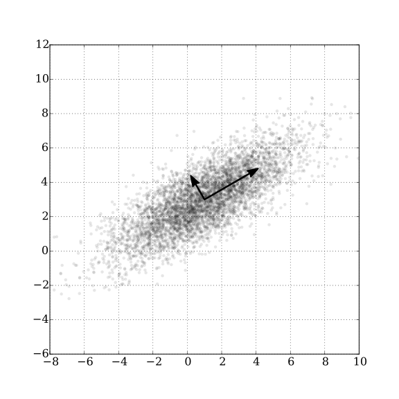

```{r setup, include=FALSE, purl=FALSE}
options(htmltools.dir.version = FALSE)
knitr::opts_chunk$set(comment = "##")
knitr::opts_chunk$set(cache = TRUE)
library(kableExtra)
library(tidyverse)
```


# Today's pet picture 


```{r, echo = FALSE, out.width = "700px", fig.align = "center"}
knitr::include_graphics("../../files/images/pets/siffy.JPG")
```

Thanks Joia! 

---

# Outline

1. Multivariate data and dimension reduction 
2. Principal Components Analysis (PCA): Theory & Application
3. Principal Components Regression


.middler[**Goal:** Practice using R to implement a statistical method to analyze multivariate data.]

---

class: inverse

.sectionhead[Part 1. Multivariate Data]

---

# Multivariate Data 

* Multi -> Multiple

* Variate -> Variables 

* Multivariate -> Multiple Variables 

--

```{r, echo = FALSE}
data(mtcars)
library(tidyverse)
library(gapminder)
data(gapminder)
```

```{r}
names(mtcars)
names(gapminder)
```

---

# Multivariate Data 

How have we analyzed multivariate data so far in our class? 

```{r}
summary(gapminder$lifeExp)
```

```{r, echo = FALSE, fig.align = 'center', fig.height = 5}
ggplot(gapminder, aes(x = lifeExp)) + 
  geom_histogram(bins = 20, fill = "lightblue", color = "black") + 
  ggtitle("Histogram of Life Expectancy") + 
  xlab("Life Expectancy (in years)") + 
  ylab("Count") + 
  theme_bw(base_size = 14) + 
  theme(plot.title = element_text(hjust = 0.5))
```

---

# Multivariate Data 

How have we analyzed multivariate data so far in our class? 

```{r}
cor(gapminder$lifeExp, gapminder$gdpPercap)
```

```{r, echo = FALSE, fig.align = 'center', fig.height = 5}
ggplot(gapminder, aes(x = lifeExp, y = log(gdpPercap))) + 
  geom_point() + 
  ggtitle("Logged GDP per Capita by Life Expectancy") + 
  xlab("Life Expectancy") + 
  ylab("Logged GDP per capita") + 
  theme_bw(base_size = 14) + 
  theme(plot.title = element_text(hjust = 0.5))
```

---

# Multivariate Data 

How have we analyzed multivariate data so far in our class? 

```{r}
mod <- lm(gdpPercap ~ continent + year + lifeExp + pop,
          data = gapminder)
```

```{r, echo = FALSE, fig.align = 'center', fig.height = 5}
summary(mod)
```

---

# Multivariate Data 

What if we want a way to look at all our variables at once? 

--

What if we want our analysis to consider the relationships between all the variables in our data, not just one or two? 

---

# Multivariate Data 

What if we want a way to look at all our variables at once? 

```{r, message = FALSE, echo = FALSE, fig.align='center', warning=FALSE}
library(GGally)
ggpairs(gapminder, columns = 4:ncol(gapminder))
```

---

# Multivariate Data 

What if we want a way to look at all our variables at once?


--


And we have more than a handful of variables?


---


# Multivariate Data 

Dimension reduction: A transformation from a high-dimensional space into a low-dimensional space so that the low-dimensional space retains some meaningful properties of the original data 

--

If we only consider quantitative variables, `gapminder` can be represented in 4 dimensions: 

```{r}
str(gapminder)
```

---

# Multivariate Data

Dimension reduction: A transformation from a high-dimensional space into a low-dimensional space so that the low-dimensional space retains some meaningful properties of the original data 


Consider this dataset with $29$ indicators of environmental performance for $180$ countries.

```{r, echo = FALSE}
environ_df <- read.csv("../projects/02_dimension_reduction/pca_data.csv")
names(environ_df[2:ncol(environ_df)])
```


---

class: inverse

.sectionhead[Part 2. Principal Components Analysis (PCA): Theory & Application]

---

# Principal Components Analysis (PCA)


.middler[**Goal**: Construct a smaller set of variables that collectively retain meaningful properties of the original data set.]

---

# Principal Components Analysis (PCA)


.middler[**Goal**: Construct a smaller set of *uncorrelated* variables that collectively retain meaningful properties of the original data set.]

---

# Principal Components Analysis (PCA)


.middler[**Goal**: Construct a smaller set of *uncorrelated linear combinations of the original variables* that collectively retain meaningful properties of the original data set.]

---

# Principal Components Analysis (PCA)


.middler[**Goal**: Construct a smaller set of *uncorrelated linear combinations of the original variables* that collectively retain *most of the variability* of the original data set.]


---

# Principal Components Analysis (PCA)

**Goal**: Construct a smaller set of *uncorrelated linear combinations of the original variables* that collectively retain *most of the variability* of the original data set.

* Principal components: *uncorrelated linear combinations of the original variables*

--

* Principal components are ordered by how much of the variability of the original data they explain

--

* Intuition: If we have $p$ original variables but we can explain most of the variability in our data with $k$ (if $k < p$) principal components, then we can reduce the dimension of our dataset while retaining most of the data's variability 

---

# Principal Components Analysis (PCA)

**Goal**: Construct a smaller set of *uncorrelated linear combinations of the original variables* that collectively retain *most of the variability* of the original data set.

* Define our original variables $\mathbf{x}_1,\ldots, \mathbf{x}_p$, where each $\mathbf{x}_j$ is a vector of length $n$ representing $n$ observations of variable $j$

--

* Define centered versions of our variables $\mathbf{x}^*_1,\ldots, \mathbf{x}^*_p$, where $\mathbf{x}^*_{j} = \mathbf{x}_{j} - \bar{x}_j$, i.e. each individual observation of variable $j$ has the mean of variable $j$ subtracted off of it.

--

* Our principal components are linear combinations of the centered data vectors:

$$\mathbf{y}_i = l_{i1}\mathbf{x}^*_1 + l_{i2}\mathbf{x}^*_2 + \ldots + l_{ip}\mathbf{x}^*_p$$
--

* We call these scaling values $l_{ij}$ loadings. 

---

# Principal Components Analysis (PCA)

## A Reminder about Variances and Covariances 

* Variance of a vector: 
$$Var(\mathbf{x}_1) = \frac{\sum_{i=1}^n (x_{i1} -\bar{x}_1)^2}{n-1}$$
--

* Covariance between two vectors: 
$$Cov(\mathbf{x}_1,\mathbf{x}_2) = \frac{\sum_{i=1}^n (x_{i1} -\bar{x}_1)(x_{i2}-\bar{x}_2)}{n-1}$$
--

* Centering doesn't affect variances or covariances:
$$Var(\mathbf{x}_1^*) = Var(\mathbf{x}_1)$$
$$Cov(\mathbf{x}_1^*,\mathbf{x}_2^*) = Cov(\mathbf{x}_1,\mathbf{x}_2)$$
---

# Principal Component 1 

* For our first principal component, we want to choose $l_{11},\ldots,l_{1p}$ in order to maximize the variance of $\mathbf{y}_1$.

$$\text{maximize}_{l_{11},\ldots,l_{1p}}\ var(\mathbf{y}_1)$$
$$\text{maximize}_{l_{11},\ldots,l_{1p}}\ var(l_{11}\mathbf{x}^*_1 + \ldots + l_{1p}\mathbf{x}^*_p)$$
--

* However, we could always increase the variance of $\mathbf{y}_1$ by just increasing the values of $\mathbf{l}_1$. Let's add the constraint that $\mathbf{l}_1^T\mathbf{l}_1 = 1$ (i.e. $\sum_{j=1}^p l_{1j}^2 = 1$). 

$$\text{maximize}_{l_{11},\ldots,l_{1p}}\ var(l_{11}\mathbf{x}^*_1 + \ldots + l_{1p}\mathbf{x}^*_p)\ \text{s.t.}\  \mathbf{l}_1^T\mathbf{l}_1 = 1$$

---

# Principal Component 2 


* Let's start with the same goal as the first principal component: 

$$\text{maximize}_{l_{21},\ldots,l_{2p}}\ var(l_{21}\mathbf{x}^*_1 + \ldots + l_{2p}\mathbf{x}^*_p)\ \text{s.t.}\  \mathbf{l}_2^T\mathbf{l}_2 = 1$$
--

* Wait, what about the uncorrelated part? 

$$\text{maximize}_{l_{21},\ldots,l_{2p}}\ var(l_{21}\mathbf{x}^*_1 + \ldots + l_{2p}\mathbf{x}^*_p)\ \text{s.t.}\  \mathbf{l}_2^T\mathbf{l}_2 = 1,\ \mathbf{l}_1^T\mathbf{l}_2 = 0$$
---

# A Brief Geometric Interpretation 

* Let's pretend that we only have two original vectors, $\mathbf{x}_1$ and $\mathbf{x}_2$. 

* First, we want to identify the axes along which the data have the most variance.

.center[]

.footnote[[Source on stackexchange](https://stats.stackexchange.com/questions/2691/making-sense-of-principal-component-analysis-eigenvectors-eigenvalues)]


---

# A Brief Geometric Interpretation 

* Let's pretend that we only have two original vectors, $\mathbf{x}_1$ and $\mathbf{x}_2$. 

* Next, we want to find an uncorrelated vector that explains as much of the remaining variance as possible. 

.center[]


.footnote[[Source on Wikipedia](https://en.wikipedia.org/wiki/Principal_component_analysis)]

---

# The Other Principal Components 

* We can write the same maximization problem for each of the $p$ principal components, adding additional constraints to make sure each component is uncorrelated with all the previous ones. 

--

* For principal component $k$:

$$\text{maximize}_{l_{k1},\ldots,l_{kp}}\ var(l_{k1}\mathbf{x}^*_1 + \ldots + l_{kp}\mathbf{x}^*_p)\ \text{s.t.}\  \mathbf{l}_k^T\mathbf{l}_k = 1, \\ \ \mathbf{l}_1^T\mathbf{l}_k = 0, \mathbf{l}_2^T\mathbf{l}_k = 0, \ldots, \mathbf{l}_{k-1}^T\mathbf{l}_k = 0$$

---

# PCA in Matrix Notation 

* Let's start by returning to PC 1. In order to define $\mathbf{y}_1$, we need to find the loadings that maximize the variance of $\mathbf{y}_1$ subject to the $\mathbf{l}_1^T\mathbf{l}_1 = 1$ constraint. 

--

* Pretend, for now, that $p = 3$. 

\begin{align*}
Var(\mathbf{y}_1) &= Var(l_{11}\mathbf{x}^*_1 + l_{12}\mathbf{x}^*_2 + l_{13}\mathbf{x}^*_3) \\
 &= l_{11}^2Var(\mathbf{x}^*_1) + l_{12}^2Var(\mathbf{x}^*_2) + l_{13}^2Var(\mathbf{x}^*_3) + \\
 &\ \ \ \ \ \  2l_{11}l_{12}Cov(\mathbf{x}^*_1,\mathbf{x}^*_2) + 
 2l_{11}l_{13}Cov(\mathbf{x}^*_1,\mathbf{x}^*_3) + \\
 &\ \ \ \ \ \  2l_{12}l_{13}Cov(\mathbf{x}^*_2,\mathbf{x}^*_3)\\ 
\end{align*}

--

* Enter the sample covariance matrix for the matrix $\mathbf{X}^*$.

$$S(\mathbf{X}^*) = \begin{pmatrix}
Var(\mathbf{x}^*_1) & Cov(\mathbf{x}^*_1,\mathbf{x}^*_2) & Cov(\mathbf{x}^*_1,\mathbf{x}^*_3) \\
 Cov(\mathbf{x}^*_1,\mathbf{x}^*_2) & Var(\mathbf{x}^*_2) & Cov(\mathbf{x}^*_2,\mathbf{x}^*_3) \\
 Cov(\mathbf{x}^*_1,\mathbf{x}^*_3) & Cov(\mathbf{x}^*_2,\mathbf{x}^*_3) & Var(\mathbf{x}^*_3) 
\end{pmatrix}$$

---

# PCA in Matrix Notation

* We can rewrite $Var(\mathbf{y}_1)$ in matrix notation using the sample covariance matrix $\mathbf{S}(\mathbf{X}^*)$.

\begin{align*}
Var(\mathbf{y}_1) &= Var(l_{11}\mathbf{x}^*_1 + l_{12}\mathbf{x}^*_2 + l_{13}\mathbf{x}^*_3) \\
 &= l_{11}^2Var(\mathbf{x}^*_1) + l_{12}^2Var(\mathbf{x}^*_2) + l_{13}^2Var(\mathbf{x}^*_3) + \\
 &\ \ \ \ \ \  2l_{11}l_{12}Cov(\mathbf{x}^*_1,\mathbf{x}^*_2) + 
 2l_{11}l_{13}Cov(\mathbf{x}^*_1,\mathbf{x}^*_3) + \\
 &\ \ \ \ \ \  2l_{12}l_{13}Cov(\mathbf{x}^*_2,\mathbf{x}^*_3)\\
 &= \begin{pmatrix}l_{11} & l_{12} & l_{13} \end{pmatrix}\begin{pmatrix}
Var(\mathbf{x}^*_1) & Cov(\mathbf{x}^*_1,\mathbf{x}^*_2) & Cov(\mathbf{x}^*_1,\mathbf{x}^*_3) \\
 Cov(\mathbf{x}^*_1,\mathbf{x}^*_2) & Var(\mathbf{x}^*_2) & Cov(\mathbf{x}^*_2,\mathbf{x}^*_3) \\
 Cov(\mathbf{x}^*_1,\mathbf{x}^*_3) & Cov(\mathbf{x}^*_2,\mathbf{x}^*_3) & Var(\mathbf{x}^*_3) 
\end{pmatrix} \begin{pmatrix} l_{11} \\ l_{12} \\ l_{13}\end{pmatrix} \\
 &= \mathbf{l}_1^T\mathbf{S}(\mathbf{X}^*)\mathbf{l}_1 \\
\end{align*}
--

* We can rewrite $Var(\mathbf{y}_k)$ as $Var(\mathbf{y}_k) = \mathbf{l}_k^T\mathbf{S}(\mathbf{X}^*)\mathbf{l}_k$ for any $k \in \{1,\ldots,p\}$.

---

# PCA in Matrix Notation 

* Therefore, we can solve the following maximization problems to get our loadings for our principal components. 

\begin{align*}
\text{maximize}_{\mathbf{l}_1}\ \mathbf{l}_1^T\mathbf{S}(\mathbf{X}^*)\mathbf{l}_1\ &\text{s.t.}\ \mathbf{l}_1^T\mathbf{l}_1=1 \\
\text{maximize}_{\mathbf{l}_2}\ \mathbf{l}_2^T\mathbf{S}(\mathbf{X}^*)\mathbf{l}_2\ &\text{s.t.}\ \mathbf{l}_2^T\mathbf{l}_2=1,\ \mathbf{l}_1^T\mathbf{l}_2=0 \\
&\vdots \\
\text{maximize}_{\mathbf{l}_p}\ \mathbf{l}_p^T\mathbf{S}(\mathbf{X}^*)\mathbf{l}_p\ &\text{s.t.}\ \mathbf{l}_p^T\mathbf{l}_p=1,\ \mathbf{l}_1^T\mathbf{l}_p=0,\\
&\ \ \ \ \ \ \  \mathbf{l}_2^T\mathbf{l}_p=0,\ldots,\mathbf{l}_{p-1}^T\mathbf{l}_{p} = 0
\end{align*}

---

# Finding Loading Vectors for PCA 

* It turns out, the eigendecomposition of the sample covariance matrix $\mathbf{S}(\mathbf{X}^*)$ will give us exactly what we need to solve this maximization problems! 

--

* Using the eigendecomposition, we can write $\mathbf{S}(\mathbf{X}^*)$ as a product of other matrices, i.e. $\mathbf{S}(\mathbf{X}^*) = \mathbf{U\Lambda U}^T$, where $\mathbf{U}$ is an orthonormal matrix made up of the eigenvectors of $\mathbf{S}(\mathbf{X}^*)$ as the columns, and $\mathbf{\Lambda}$ is a diagonal matrix with the ordered eigenvalues of $\mathbf{S}(\mathbf{X}^*)$ on the diagonals.

--

* An orthonormal matrix has the property that for each column $\mathbf{u}_i$, $\mathbf{u}_i^T\mathbf{u}_i = 1$ and for $i \neq j$, $\mathbf{u}_i^T\mathbf{u}_j = 0$.

--

* TLDR (avoiding the linear algebra): If we perform an eigendecomposition of $\mathbf{S}(\mathbf{X}^*)$, the columns of the matrix $\mathbf{U}$ will give us our variable loadings for our principal components! 


.footnote[Note: We could also get our loading vectors using the Singular Value Decomposition (SVD) of the matrix X*. These will give the same results!]

---

# Finding Principal Components 

* Remember, that we've defined the first principal component as the vector $\mathbf{y}_1= l_{11}\mathbf{x}^*_1+\ldots + l_{1p}\mathbf{x}^*_p$. 

--

* Therefore, to compute our $\mathbf{y}_i$ vectors, we need to multiply our loadings with our $\mathbf{x}^*_i$ vectors, which are our centered variables. 

--

* We can again use matrix multiplication to do this all at once! If $\mathbf{X}^*$ is our $n\times p$ data matrix and $\mathbf{Y}$ is our $n\times p$ matrix of principal component vectors, we can write:
$$\mathbf{Y} = \mathbf{X}^*\mathbf{U}$$

---

# Steps to Perform PCA 

1. Mean center each variable of your data matrix $\mathbf{X}$ to get $\mathbf{X}^*$.

--

2. Compute the empirical covariance matrix of $\mathbf{X}^*$, $\mathbf{S}(\mathbf{X}^*)$.

--

3. Perform an eigendecomposition, $\mathbf{S}(\mathbf{X}^*) = \mathbf{U\Lambda U}^T$.

--

4. Use the columns of $\mathbf{U}$ as the loading vectors.

--

5. Multiply the centered matrix $\mathbf{X}^*$ by the loadings to get the principal component vectors, $\mathbf{Y} = \mathbf{X}^*\mathbf{U}$.

---


# Example of PCA 

Let's use the five quantitative variables from the `mtcars` dataset. We'll use the R function `princomp()`. 

```{r}
cars_pca_df <- mtcars %>% 
  select(mpg, disp, drat, wt, qsec)
cars_pca <- princomp(cars_pca_df)
cars_pca$loadings
```

---

# Example of PCA

Let's look closer at the loadings on the first two principal components. 

```{r, echo = FALSE, fig.align='center'}
plot_df <- data.frame(loading1 = cars_pca$loadings[ ,1],
                      loading2 = cars_pca$loadings[, 2],
                      name = names(cars_pca_df))
ggplot(plot_df, aes(x = loading1,
                    y = loading2,
                    label = name)) + 
  geom_point() + 
  geom_text(nudge_x = 0.06) + 
  geom_hline(yintercept = 0, color = "gray") + 
  geom_vline(xintercept = 0, color = "gray") +
  xlab("Loadings for Principal Component 1") + 
  ylab("Loadings for Principal Component 2") + 
  ggtitle("Loadings for First Two Principal Components") + 
  theme_bw(base_size = 12) + 
  theme(plot.title = element_text(hjust = 0.5))
```

---

# Example of PCA

Let's look closer at the loadings. 

.pull-left[
```{r, echo = FALSE, fig.align='center'}
plot_df <- data.frame(loading1 = cars_pca$loadings[ ,1],
                      loading2 = cars_pca$loadings[, 2],
                      name = names(cars_pca_df))
ggplot(plot_df, aes(x = loading1,
                    y = loading2,
                    label = name)) + 
  geom_point() + 
  geom_text(nudge_x = 0.06) + 
  geom_hline(yintercept = 0, color = "gray") + 
  geom_vline(xintercept = 0, color = "gray") +
  xlab("Loadings for Principal Component 1") + 
  ylab("Loadings for Principal Component 2") + 
  ggtitle("Loadings for First Two Principal Components") + 
  theme_bw(base_size = 12) + 
  theme(plot.title = element_text(hjust = 0.5))
```
]

.pull-right[
```{r}
apply(cars_pca_df, 2, range)
```
]

---

# Scaling Variables before PCA 

* Because of this behavior, where principal components depend on the scale of the data, we often scale our variables before performing PCA.
* To scale a variable $\mathbf{x}_j$, first take the centered variable $\mathbf{x}^*_j$, then divide by the standard deviation of variable $j$, to get the centered and scaled version of variable $i$, $\tilde{\mathbf{x}}_j$.

---

# Steps to Perform PCA on Scaled Data 

1. Mean center each variable of your data matrix $\mathbf{X}$ to get $\mathbf{X}^*$.

--

2. Scale each variable of your data matrix $\mathbf{X}^*$ by its standard deviation to get $\tilde{\mathbf{X}}$.

--

3. Compute the empirical covariance matrix of $\tilde{\mathbf{X}}$, $\mathbf{S}(\tilde{\mathbf{X}})$. (Note that this would be equal to the empirical correlation matrix of the original data $\mathbf{X}$!)

--

4. Perform an eigendecomposition, $\mathbf{S}(\tilde{\mathbf{X}}) = \mathbf{U\Lambda U}^T$.

--

5. Use the columns of $\mathbf{U}$ as the loading vectors.

--

6. Multiply the centered and scaled matrix $\tilde{\mathbf{X}}$ by the loadings to get the principal component vectors, $\mathbf{Y} = \tilde{\mathbf{X}}\mathbf{U}$.

---

# Pet picture of the day 

```{r, echo = FALSE, out.width = "400px", fig.align = "center"}

```

---

# Review 

## What is the goal of dimension reduction? 

--

## What is the goal of PCA? 

---

# Correction 

## Mistake last week in the slides: 

To get principal component vectors, compute $\mathbf{Y} = \mathbf{U}\tilde{\mathbf{X}}$. 

## Corrected version: 

To get principal component vectors, compute $\mathbf{Y} = \tilde{\mathbf{X}}\mathbf{U}$. 

---

# Steps to Perform PCA on Scaled Data 

1. Mean center each variable of your data matrix $\mathbf{X}$ to get $\mathbf{X}^*$.

--

2. Scale each variable of your data matrix $\mathbf{X}^*$ by its standard deviation to get $\tilde{\mathbf{X}}$.

--

3. Compute the empirical covariance matrix of $\tilde{\mathbf{X}}$, $\mathbf{S}(\tilde{\mathbf{X}})$. (Note that this would be equal to the empirical correlation matrix of the original data $\mathbf{X}$!)

--

4. Perform an eigendecomposition, $\mathbf{S}(\tilde{\mathbf{X}}) = \mathbf{U\Lambda U}^T$.

--

5. Use the columns of $\mathbf{U}$ as the loading vectors.

--

6. Multiply the centered and scaled matrix $\tilde{\mathbf{X}}$ by the loadings to get the principal component vectors, $\mathbf{Y} = \tilde{\mathbf{X}}\mathbf{U}$.

---

# Back to our example 

```{r}
cars_pca_df <- mtcars %>% 
  select(mpg, disp, drat, wt, qsec)
cars_pca_scaled <- princomp(cars_pca_df, cor = TRUE)
cars_pca_scaled$loadings
```

---

# Back to our example

Let's look closer at the loadings on the first two principal components. 

```{r, echo = FALSE, fig.align='center'}
plot_df <- data.frame(loading1 = cars_pca_scaled$loadings[ ,1],
                      loading2 = cars_pca_scaled$loadings[, 2],
                      name = names(cars_pca_df))
loading_plot <- ggplot(plot_df, aes(x = loading1,
                    y = loading2,
                    label = name)) + 
  geom_point() + 
  geom_hline(yintercept = 0, color = "gray") + 
  geom_vline(xintercept = 0, color = "gray") +
  geom_text(nudge_x = 0.06) + 
  xlab("Loadings for Principal Component 1") + 
  ylab("Loadings for Principal Component 2") + 
  ggtitle("Loadings for First Two Principal Components") + 
  theme_bw(base_size = 12) + 
  theme(plot.title = element_text(hjust = 0.5))
loading_plot
```

---

# Wait, what about dimension reduction? 

* Remember, the whole point of PCA is to construct a set of *uncorrelated linear combinations of the original variables* that collectively retain *most of the variability* of the original data set.

--

* Our principal components are ordered by the amount of variability they can explain. 

--

* Intuition: If we have $p$ original variables but we can explain most of the variability in our data with $k$ (if $k < p$) principal components, then we can reduce the dimension of our dataset while retaining most of the data's variability. 

---

# How many principal components to use? 

* If we keep all $p$ principal component vectors $\mathbf{y}_j$, $j\in\{1,\ldots,p\}$, then we can explain all of the variance in our centered data matrix $\mathbf{X}^*$ (or scaled data matrix $\tilde{\mathbf{X}}$). 

--

* Remember our eigendecomposition, $\mathbf{S}(\tilde{\mathbf{X}}) = \mathbf{U\Lambda U}^T$, in which $\mathbf{\Lambda}$ is a diagonal matrix with the eigenvalues of $\mathbf{S}$ sorted in descending order.

--

* Denote the ordered diagonal values from our $\mathbf{\Lambda}$ matrix as $\lambda_1,\ldots,\lambda_p$.

--

* The proportion of variance explained (PVE) of principal component $j$ is equal to the $j$th eigenvalue from the eigendecomposition, $\lambda_j$.

--

* If we only keep $k$ of the $p$ principal components, then we will explain a proportion of the variance in our data: 
$$\text{PVE}_{1:k} = \frac{\sum_{j=1}^k \lambda_j}{\sum_{j'=1}^p \lambda_{j'}}$$

---

# How many principal components to use? 

* We'd like to choose a value $k$ that is small enough to reduce the dimension substantially and big enough to explain much of the data's variability. 

---

# How many principal components to use? 

* We can make a scree plot to visualize the proportion of variance explained by each principal component. 

```{r, fig.align='center', fig.height = 5}
screeplot(cars_pca_scaled, type = "lines", main = "Scree Plot")
```

* In a scree plot, we look for the "elbow."

---

# How many principal components to use? 

* We can make a scree plot to visualize the proportion of variance explained by each principal component. 

```{r, fig.align='center', echo = FALSE, fig.height = 6.5} 
scree_df <- data.frame(component = 1:length(cars_pca_scaled$sdev),
                       variance = cars_pca_scaled$sdev^2)
scree_df$cum_var <- cumsum(scree_df$variance)
ggplot(scree_df, aes(x = as.numeric(component), y = cum_var)) + 
  geom_line() + 
  geom_point() + 
  ylim(c(0, 5)) + 
  xlab("Component") + 
  ylab("Cumulative Variance Explained") + 
  ggtitle("Cumulative Scree Plot") + 
  theme_bw(base_size = 14) + 
  theme(plot.title = element_text(hjust = 0.5))
```

---

# How many principal components to use? 

* In practice, we often look primarily at the first two principal components, because we can plot these in two dimensions. 

.pull-left[
```{r, eval = FALSE}
plot_df <- 
  data.frame(pc1 = cars_pca_scaled$
               scores[, 1],
             pc2 = cars_pca_scaled$
               scores[, 2],
             name = rownames(mtcars))
ggplot(plot_df, 
       aes(x = pc1, y = pc2, 
           label = name)) + 
  geom_point() + 
  geom_text(size = 4, 
            nudge_x = .12, 
            nudge_y = .12) + 
  labs(x = "Principal Component 1", 
       y = "Principal Component 2",
       title = "First Two Principal Components of mtcars") + 
  theme_bw(base_size = 12) + 
  theme(plot.title = 
          element_text(hjust = 0.5))
```
]

.pull-right[
```{r, echo = FALSE}
plot_df <- 
  data.frame(pc1 = cars_pca_scaled$scores[, 1],
             pc2 = cars_pca_scaled$scores[, 2],
             name = rownames(mtcars))
ggplot(plot_df, 
       aes(x = pc1, y = pc2, label = name)) + 
  geom_point() + 
  geom_text(size = 4, 
            nudge_x = .12, nudge_y = .12) + 
  labs(x = "Principal Component 1", 
       y = "Principal Component 2",
       title = "First Two Principal Components of mtcars") + 
  theme_bw(base_size = 12) + 
  theme(plot.title = element_text(hjust = 0.5))
```
]

---

# How many principal components to use? 

* In practice, we often look primarily at the first two principal components, because we can plot these in two dimensions. 

.pull-left[
```{r, eval = FALSE}
text_df <- plot_df %>%
  filter(name %in%
           c("Merc 230", "Hornet 4 Drive",
             "Lotus Europa", "Porsche 914-2",
             "Maserati Bora", "Ferrari Dino"))
ggplot(plot_df, 
       aes(x = pc1, y = pc2,
           label = name)) + 
  geom_point() + 
  geom_text(data = text_df,
            size = 4, 
            nudge_x = .12, 
            nudge_y = .12) + 
  labs(x = "Principal Component 1", 
       y = "Principal Component 2",
       title = "First Two Principal Components of mtcars") + 
  theme_bw(base_size = 12) + 
  theme(plot.title = 
          element_text(hjust = 0.5))
```
]

.pull-right[
```{r, echo = FALSE}
text_df <- plot_df %>%
  filter(name %in%
           c("Merc 230", "Hornet 4 Drive",
             "Lotus Europa", "Porsche 914-2",
             "Maserati Bora", "Ferrari Dino"))
pc2_plot <- ggplot(plot_df, 
       aes(x = pc1, y = pc2,
           label = name)) + 
  geom_point() + 
  geom_text(data = text_df,
            size = 4, 
            nudge_x = .12, 
            nudge_y = .12) + 
  labs(x = "Principal Component 1", 
       y = "Principal Component 2",
       title = "First Two Principal Components of mtcars") + 
  theme_bw(base_size = 12) + 
  theme(plot.title = 
          element_text(hjust = 0.5))
pc2_plot
```
]

---

# Biplots 

* Biplots show the observations and loadings for the first two principal components. 

```{r, fig.align='center', fig.height = 6}
biplot(cars_pca_scaled)
```

---

# Biplots 

.pull-left[
```{r, echo = FALSE}
loading_plot
```
]

.pull-right[
```{r, echo = FALSE}
pc2_plot
```
]

---

# Back to first two principal components 

```{r, echo = FALSE, fig.align='center'}
plot_df <- 
  data.frame(pc1 = cars_pca_scaled$scores[, 1],
             pc2 = cars_pca_scaled$scores[, 2],
             name = rownames(mtcars),
             transmission = mtcars$am)
ggplot(plot_df, 
       aes(x = pc1, y = pc2, 
           label = name,
           color = as.factor(transmission))) + 
  geom_point(size = 3) + 
  labs(x = "Principal Component 1", 
       y = "Principal Component 2",
       color = "Transmission",
       title = "First Two Principal Components of mtcars") + 
  theme_bw(base_size = 12) + 
  theme(plot.title = 
          element_text(hjust = 0.5))
```

---

# Back to first two principal components 

```{r, eval = FALSE, fig.align='center'}
plot_df <- 
  data.frame(pc1 = cars_pca_scaled$scores[, 1],
             pc2 = cars_pca_scaled$scores[, 2],
             name = rownames(mtcars),
             transmission = mtcars$am)
ggplot(plot_df, 
       aes(x = pc1, y = pc2, 
           label = name,
           color = as.factor(transmission))) + 
  geom_point(size = 3) + 
  labs(x = "Principal Component 1", 
       y = "Principal Component 2",
       color = "Transmission",
       title = "First Two Principal Components of mtcars") + 
  theme_bw(base_size = 12) + 
  theme(plot.title = 
          element_text(hjust = 0.5))
```

---

# Back to first two principal components 

```{r, echo = FALSE, fig.align='center'}
plot_df <- 
  data.frame(pc1 = cars_pca_scaled$scores[, 1],
             pc2 = cars_pca_scaled$scores[, 2],
             name = rownames(mtcars),
             cylinders = mtcars$cyl)
ggplot(plot_df, 
       aes(x = pc1, y = pc2, 
           label = name,
           color = as.factor(cylinders))) + 
  geom_point(size = 3) + 
  labs(x = "Principal Component 1", 
       y = "Principal Component 2",
       color = "Cylinders",
       title = "First Two Principal Components of mtcars") + 
  theme_bw(base_size = 12) + 
  theme(plot.title = 
          element_text(hjust = 0.5))
```

---

# Back to first two principal components 

```{r, eval = FALSE, fig.align='center'}
plot_df <- 
  data.frame(pc1 = cars_pca_scaled$scores[, 1],
             pc2 = cars_pca_scaled$scores[, 2],
             name = rownames(mtcars),
             cylinders = mtcars$cyl)
ggplot(plot_df, 
       aes(x = pc1, y = pc2, 
           label = name,
           color = as.factor(cylinders))) + 
  geom_point(size = 3) + 
  labs(x = "Principal Component 1", 
       y = "Principal Component 2",
       color = "Cylinders",
       title = "First Two Principal Components of mtcars") + 
  theme_bw(base_size = 12) + 
  theme(plot.title = 
          element_text(hjust = 0.5))
```

---

# Back to first two principal components 

```{r, echo = FALSE, fig.align='center'}
plot_df <- 
  data.frame(pc1 = cars_pca_scaled$scores[, 1],
             pc2 = cars_pca_scaled$scores[, 2],
             name = rownames(mtcars),
             engine = mtcars$vs)
ggplot(plot_df, 
       aes(x = pc1, y = pc2, 
           label = name,
           color = as.factor(engine))) + 
  geom_point(size = 3) + 
  labs(x = "Principal Component 1", 
       y = "Principal Component 2",
       color = "Engine",
       title = "First Two Principal Components of mtcars") + 
  theme_bw(base_size = 12) + 
  theme(plot.title = 
          element_text(hjust = 0.5))
```

---

# Back to first two principal components 

```{r, eval = FALSE, fig.align='center'}
plot_df <- 
  data.frame(pc1 = cars_pca_scaled$scores[, 1],
             pc2 = cars_pca_scaled$scores[, 2],
             name = rownames(mtcars),
             engine = mtcars$vs)
ggplot(plot_df, 
       aes(x = pc1, y = pc2, 
           label = name,
           color = as.factor(engine))) + 
  geom_point(size = 3) + 
  labs(x = "Principal Component 1", 
       y = "Principal Component 2",
       color = "Engine",
       title = "First Two Principal Components of mtcars") + 
  theme_bw(base_size = 12) + 
  theme(plot.title = 
          element_text(hjust = 0.5))
```

---

# Back to first two principal components 

```{r, echo = FALSE, fig.align='center'}
plot_df <- 
  data.frame(pc1 = cars_pca_scaled$scores[, 1],
             pc2 = cars_pca_scaled$scores[, 2],
             name = rownames(mtcars),
             hp = mtcars$hp)
ggplot(plot_df, 
       aes(x = pc1, y = pc2, 
           label = name,
           color = hp)) + 
  geom_point(size = 3) + 
  labs(x = "Principal Component 1", 
       y = "Principal Component 2",
       color = "Horse Power",
       title = "First Two Principal Components of mtcars") + 
  theme_bw(base_size = 12) + 
  theme(plot.title = 
          element_text(hjust = 0.5)) + 
  scale_color_continuous(low = "blue", high = "red")
```

---

# Back to first two principal components 

```{r, eval = FALSE, fig.align='center'}
plot_df <- 
  data.frame(pc1 = cars_pca_scaled$scores[, 1],
             pc2 = cars_pca_scaled$scores[, 2],
             name = rownames(mtcars),
             hp = mtcars$hp)
ggplot(plot_df, 
       aes(x = pc1, y = pc2, 
           label = name,
           color = hp)) + 
  geom_point(size = 3) + 
  labs(x = "Principal Component 1", 
       y = "Principal Component 2",
       color = "Horse Power",
       title = "First Two Principal Components of mtcars") + 
  theme_bw(base_size = 12) + 
  theme(plot.title = 
          element_text(hjust = 0.5)) + 
  scale_color_continuous(low = "blue", high = "red")
```

---

class: inverse

.sectionhead[Part 3. Principal Components Regression]

---

# Principal Components Regression

## Multicollinearity 

--

* Multicollinearity is a condition in which one covariate can be linearly predicted from other covariates in a regression. 

--

* This can cause problems with t tests for the coefficients in linear regression.

---

# Principal Components Regression

```{r}
cor(mtcars[,c("mpg", "disp", "drat", "wt", "qsec")])
```

```{r}
cor(mtcars$hp, mtcars[,c("mpg", "disp", "drat", "wt", "qsec")])
```

---

# Principal Components Regression

```{r}
mod <- lm(hp ~ mpg + disp + drat + wt + qsec, data = mtcars)
summary(mod)
```

---

# Principal Components Regression 

## Steps for Principal Components Regression

--

1. Run PCA. 

--

2. Do linear regression on a set of the principal components.

---

# Principal Components Regression

```{r}
mtcars_pcs <- data.frame(cars_pca_scaled$scores)
mtcars_pcs$hp <- mtcars$hp
mod_pc <- lm(hp ~ ., data = mtcars_pcs)
summary(mod_pc)
```

